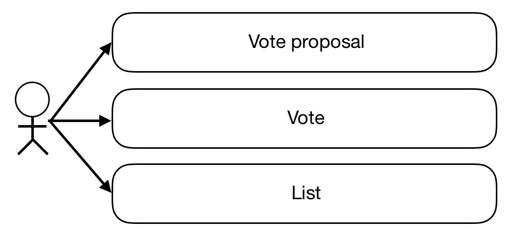
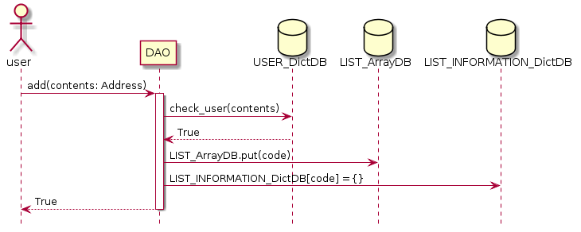
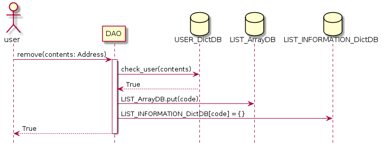
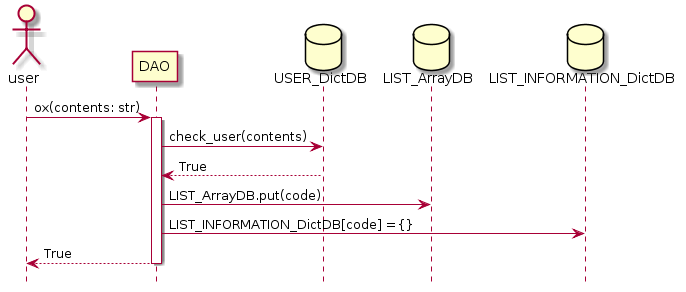
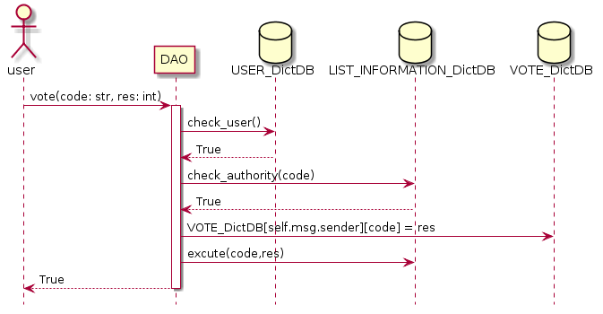
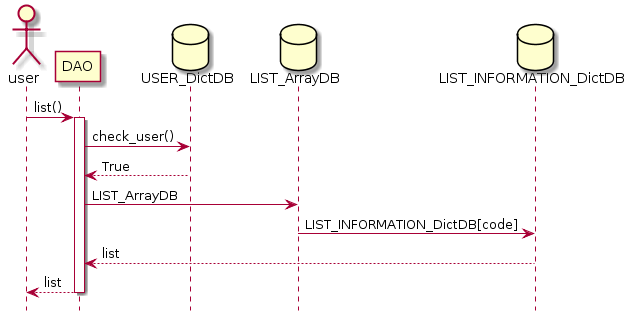
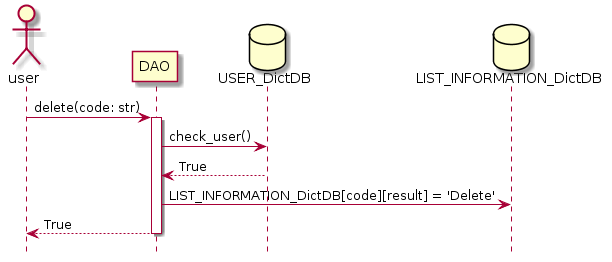

# DAO Sample code
## 개요
Decentralized Autonomous Organization 의 약자로 탈중앙화된 자율조직을 뜻한다. 
즉 DAO는 자율적이다. 일단 DAO가 배포되면 외부의 세력이 DAO를 방해할 수 없다.
자율적으로 돌아가는 DAO Sample을 만들어보자.

## 개발 목표
사내 의사결정 투표 시스템을 구현하자 

       
## Usecase
   
   1. 투표 제안 기능
        * 유저추가
        * 유저제거
        * 찬반 투표 안건 제안
   2. 투표(찬성,반대 표 보내기)
   3. 투표 리스트 확인 기능 
  

## Vote proposal 
   ### add
   
   ### remove
   
   ### ox
   
   
   * 사용자가 어떤 안건을 투표할지 제안한다.
   * 투표 제안은 USER_DictDB 등록된 사용자만 이용가능하다.
   * 사용자가 제안을하면 USER_DictDB를통해 제안이 가능한지 확인을한다.
   * LIST_ArrayDB에 code를 put한다
        * add인경우 첫글자는 A로시작한다.
        * remove인경우 첫글자는 R로시작한다.
        * OX인경우 첫글자는 O로시작한다.
   * LIST_INFORMATION_DictDB에 code를 key값으로 사용하여 json형태로 투표 정보를 담는다.
        * {"contents":"","date":"","total_num":"","agree_num":"","opposition_num":"","proposer":"","result":""}"
   * method
        * `add` : 추가할 멤버를 투표 신청한다.
            * 추가할 address 입력하여야 한다.
            * 입력한 address 가 기존에 회원 목록에 존재할 경우 진행되지 않는다.
        * `remove` : 제거할 멤버를 투표 신청한다.
            * 제거할 address 입력하여야 한다.
            * 입력한 address 가 기존에 회원 목록에 존재하지 않을 경우 진행되지 않는다.
        * `ox` : 찬반을 가릴 안건을 투표 신청한다.
            * ex) 회식 진행할까요
            * 제안안건 미입력시 진행되지 않는다.

   
      

## Vote
   
   
   * 제안된 투표를 찬성,반대로 투표한다.
   * 유저추가, 유저제거, 제안된안건에 투표할 수 있다.
   * code를 이용하여 vote() 한다.
   * 찬성의경우 `1`, 반대의경우 `2`를 입력한다
   * address를 이용해 USER_DictDB에 등록된 유저인가를 확인한다
   * USER_DictDB에 유저정보와, LIST_INFORMATION_DictDB에 제안 정보를 확인하여 투표권한이 있는지 확인한다.
   * VOTE_DictDB에 자신의 투표결과를 입력한다.
        * VOTE_DictDB[자신의주소][선택한투표코드] = `1`or`2`(찬성or반대)
   * excute()가 실행된다
        * LIST_INFORMATION_DictDB에 입력되어있는 `agree_num`,`opposition_num` 확인하여 투표를 진행한다.
        * 찬성인 경우 `agree_num` 1 감소, 반대인 경우 `opposition_num` 1 감소
        * `agree_num`또는 `opposition_num` 이 0이될시 결과가 자동으로 실행된다.
        * LIST_INFORMATION_DictDB에 `result`가 찬성된 경우는 Allow, 반대된 경우는 Refuse가 입력된다
   * 과반수가 넘을시 결과가실행 된다.
   * method
        * `vote` : 해당 투표에 찬성과반대로 투표할 수 있다.
            * 코드,찬성및반대 입력
            * 입력한 투표내용은 DB에 등록된다.

   
   
       
## List
   
  
   * 투표 목록을 확인한다.
   * 투표 목록 확인은 USER_DictDB 등록된 사용자만 이용가능하다.
   * 투표 전체 목록을 확인할 수 있다.
   * method
        * `list` : 투표 목록을 확인한다.
        
## Delete
      
   
   * 기존에 등록된 제안를 삭제한다.
   * 자신이 등록한 제안만 삭제할 수 있다.
   * 투표 결과가 나온 상태에 제안은 삭제 할 수 없다.
   * method
        * `delete` : 투표 제안을 삭제한다.

   

    
    
    
       

