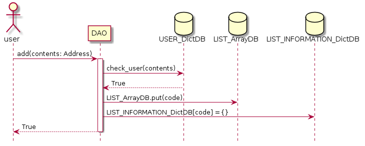
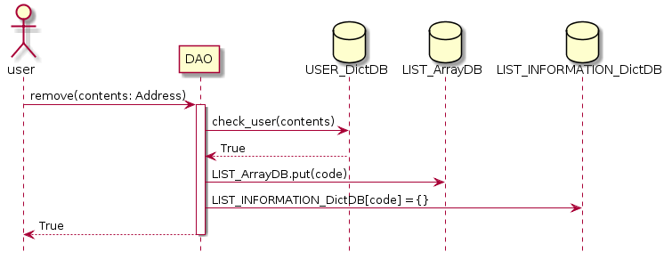
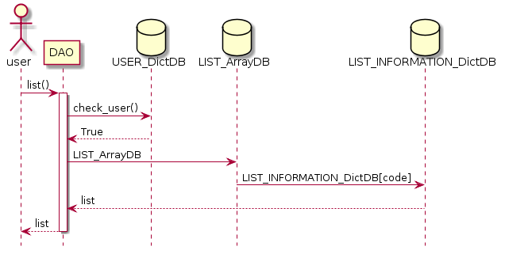
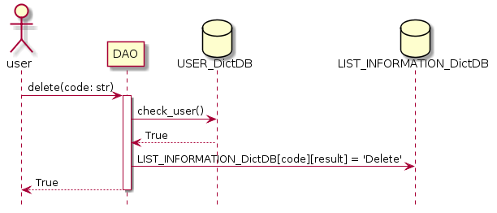

# DAO Sample code
## summary
Decentralized Autonomous Organization 
In other words, DAO is autonomous. Once the DAO is released, no outside forces can interfere with the DAO.

## Development Purpose
Implement an in-house decision-making voting system 

       
## Usecase
   
   1. Vote suggestions feature
        * Add users
        * Remove user
        * Proposal for pros and cons
   2. vote
   3. Ability to check the voting list
  

## Vote proposal 
   ### add
   
   ### remove
   
   ### ox
   
   
   * The user suggests which item to vote on.
   * Voting suggestions are only available to registered USER_DictDB users.
   * If the user makes a suggestion, check whether the suggestion is possible through USER_DictDB.
   * Put code in LIST_ArrayDB
        * If it is add, the first letter starts with A.
        * If it is remove, the first letter starts with R.
        * If it is ox, the first letter starts with O.
   * Use LIST_INFORMATION_DictDB with code as key value to contain voting information in json format.
        * {"contents":"","date":"","total_num":"","agree_num":"","opposition_num":"","proposer":"","result":""}"
   * method
        * `add` : Vote for users to add.
            * Register address to add.
            * If the address entered exists in the list of members already, it will not proceed.
        * `remove` : Vote for users to remove.
            * Register address to remove.
            * If the address entered does not already exist on the list of members, it will not proceed.
        * `ox` : Vote for the pros and cons.
            * ex) Shall we proceed with the dinner?
            * If the proposal is not entered, it is not processed.

   
      

## Vote
   
   
   * Vote for, vote against, the proposed vote.
   * Vote for add user, remove user, proposed item
   * Use the code to Vote().
   * Enter `1` for the agree and `2` for the opposite.
   * Check whether the user is registered in USER_DictDB using address
   * Check user information in USER_DictDB and proposal information in LIST_INFORMATION_DictDB to see if there is a right to vote.
   * Enter your vote in VOTE_DictDB.
        * VOTE_DictDB [your address] [selected voting code] = `1`or`2` (agree or opposite)
   * execute () is executed
        * Confirm `agree_num` and` opposition_num` entered in LIST_INFORMATION_DictDB and vote.
        * Decrease `agree_num` 1 if agree, Decrease `opposition_num` 1 if opposite
        * When `agree_num` or` opposition_num` becomes 0, the result is opposite automatically.
        * If `result` is agree in LIST_INFORMATION_DictDB, Allow, If `result` is approved in LIST_INFORMATION_DictDB, Refuse
   * The result is executed when the majority is exceeded.
   * method
        * `vote` : You can vote agree or opposite
            * Param is code, vote_res(agree or opposite)
            * The entered votes are registered in the VOTE_DictDB.
   
       
## List
   
  
   * Check the voting list.
   * Voting list confirmation is only available to registered USER_DictDB users.
   * You can see the full list of votes.
   * method
        * `list` : Check the voting list.
        
## Delete
      
   
   * Delete the existing registered proposal.
   * You can delete only the proposals you have registered.
   * Proposals can not be deleted with voting results.
   * method
        * `delete` : Delete the voting proposal.

   

    
    
    
       

